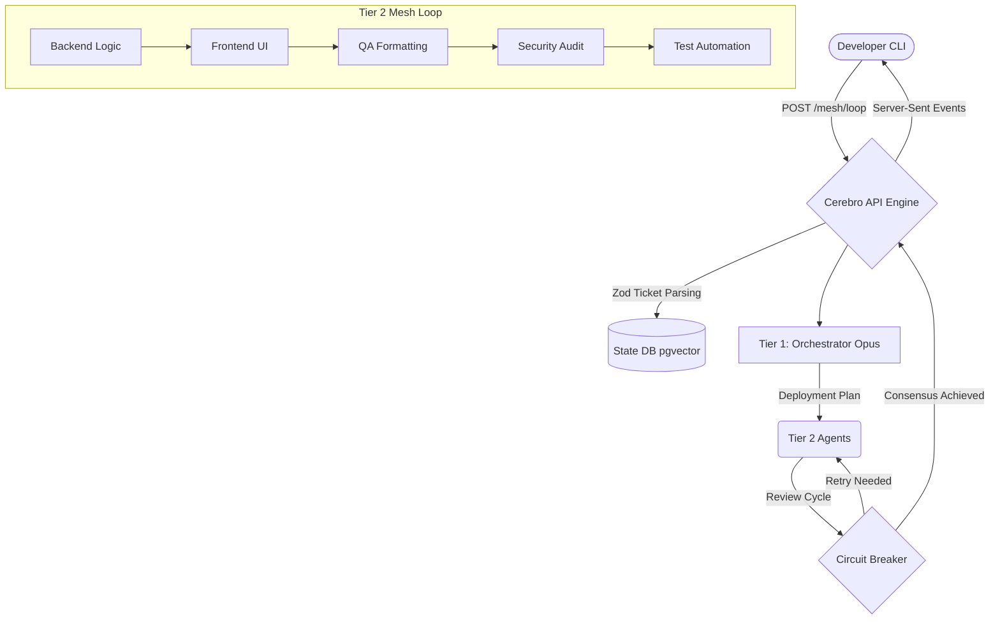

# Cerebro

An **Enterprise Multi-Agent Orchestration Platform & Developer CLI**. 

Cerebro bridges the gap between local development workflows and cloud infrastructure orchestration. It is a blazingly fast, multi-tier agentic system that writes, tests, and reviews code autonomously natively on your codebase while strictly enforcing KISS, DRY, and SOLID principles.

## 🧠 Architecture Overview

Cerebro runs heavily decoupled across a **2-Tier AI Mesh Architecture**:

1. **Tier 1 (The Orchestrator)**: Uses Anthropic Claude 3 Opus (via Google Cloud Vertex AI) to parse CLI `develop` intents into strictly constrained, hyper-focused JSON execution plans.
2. **Tier 2 (The Specialized Mesh)**: Uses highly precise Claude 3 Sonnet agents acting entirely asynchronously in a strict verification loop:
   - **Backend Agent**
   - **Frontend Agent**
   - **Quality Assurance Agent**
   - **Security Auditor Agent**
   - **Testing Automation Agent**
   - **Ops / Infrastructure Agent**

### 🔄 Mesh Execution Diagram



## 🏗️ Transparent Tech Stack
- **Monorepo:** Turborepo (`v2.8.x`)
- **Runtime Environment:** Bun (`v1.2.x`)
- **Engine API Core:** Hono (`v4.x`, port `8080`)
- **CLI Interface:** Clack Prompts & Picocolors (`v1.1.x`)
- **Database & Persistence:** PostgreSQL (latest) with `pgvector` for advanced semantic embeddings
- **AI Integration Framework:** LangChain Core (`v1.1.x`) targeting `@langchain/google-vertexai`

---

## ⚡ Getting Started

The easiest way to orchestrate the Cerebro environment is by utilizing the built-in `Makefile` at the repository root.

1. **Setup Core Dependencies & local Database:**
   Ensure Docker is running, then install all monorepo dependencies and boot the persistence layer (`pgvector`):
   ```bash
   make setup
   ```

2. **Boot the AI Engine Server:**
   This runs the Hono mesh execution endpoints natively via Bun. Ensure you have the Anthropic Vertex AI credentials configured globally (e.g., `gcloud auth application-default login`) and `ANTHROPIC_VERTEX_PROJECT_ID` set.
   ```bash
   make dev-engine
   ```

3. **Trigger the Cerebro CLI:**
   Open a separate terminal to interface with your running engine:
   ```bash
   # Starts the CLI interactive routing menu:
   make dev-cli
   
   # Or manually execute an inline command:
   cd apps/cli
   bun run dev develop "Create a basic Next.js login component"
   ```

   *Watch your CLI stream beautifully formatted Server-Sent Events (SSE) tracking the exact execution paths and computing the exact LLM token expenditures dynamically!*

## 🛡️ Design Primitives
- **Built-in Circuit Breaker**: Deep integrations of a retry limit that prevents infinite loops or recursive hallucinations escaping the Mesh execution loop.
- **Framework Agnostic**: The Tier 2 agents do NOT mandate specific codebases or languages; they actively sniff your current context and output identical stack designs.
- **Extreme Observability**: The `apps/engine` and CLI continuously trace granular sub-process behaviors natively directly to your CLI.

---

*Cerebro is built for developers who demand enterprise-grade validation in a zero-friction CLI.*
