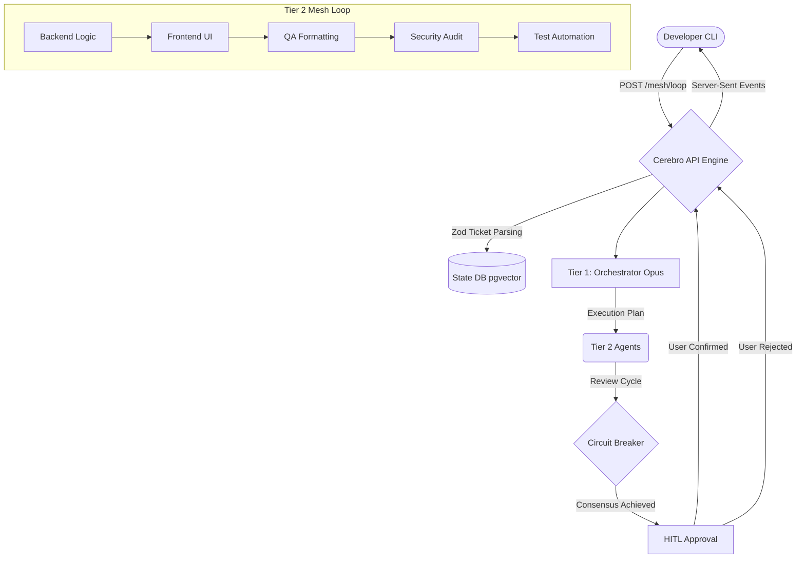

# Cerebro

An **Enterprise Multi-Agent Orchestration Platform & Developer CLI**.

Cerebro bridges the gap between local development workflows and cloud infrastructure orchestration. It is a blazingly fast, multi-tier agentic system that writes, tests, and reviews code autonomously natively on your codebase while strictly enforcing KISS, DRY, and SOLID principles.

## 🧠 Architecture Overview

Cerebro runs heavily decoupled across a **2-Tier AI Mesh Architecture**:

1. **Tier 1 (The Orchestrator)**: Uses Anthropic Claude 4.6 Opus to parse CLI `develop` intents into strictly constrained, hyper-focused JSON execution plans with agent dependencies.
2. **Tier 2 (The Specialized Mesh)**: Uses highly precise Claude 4.6 Sonnet agents acting asynchronously with dynamic dispatch:
   - **Backend Agent** - APIs, DB logic, SOLID principles
   - **Frontend Agent** - UI components, WCAG compliance
   - **Quality Assurance Agent** - Code formatting, AST parsing, Biome enforcement
   - **Security Auditor Agent** - OWASP Top 10 vulnerability scanning
   - **Testing Automation Agent** - Jest/Vitest, 100% coverage enforcement
   - **Ops / Infrastructure Agent** - Docker, CI/CD, 12-Factor App rules

### 🔄 Mesh Execution Diagram



### 📊 Token Tracking

All agent executions track token consumption in real-time with cost analytics:

- **Input/Output/Total Tokens** per agent type
- **Cost Calculation** using 2025 pricing models (Opus, Sonnet, Haiku)
- **Visual Breakdown** displayed in final CLI summary

## 🏗️ Transparent Tech Stack

| Component | Technology | Version |
|-----------|-------------|----------|
| **Monorepo** | Turborepo | `v2.8.x` |
| **Runtime Environment** | Bun | `v1.2.x` |
| **Engine API Core** | Hono | `v4.x` (port `8080`) |
| **CLI Interface** | Clack Prompts & Picocolors | `v1.1.x` |
| **Database & Persistence** | PostgreSQL + pgvector | Latest |
| **Database Client** | `postgres` npm package | Latest |
| **AI Integration Framework** | LangChain Core | `v1.1.x` |
| **Data Validation** | Zod | `v3.x` |
| **Code Quality** | Biome | `v2.x` |

---

## ⚡ Getting Started

The easiest way to orchestrate Cerebro environment is by utilizing the built-in `Makefile` at the repository root.

### Prerequisites

- **Bun** `v1.2.x` or later
- **Docker** (for local PostgreSQL + pgvector)
- **Anthropic API Key** - Set as `ANTHROPIC_API_KEY` environment variable

### Quick Start

1. **Setup Core Dependencies & local Database:**
   Ensure Docker is running, then install all monorepo dependencies and boot the persistence layer (`pgvector`):
   ```bash
   make setup
   ```

2. **Boot the AI Engine Server:**
   This runs the Hono mesh execution endpoints natively via Bun. Ensure you have Anthropic API credentials configured:
   ```bash
   make dev-engine
   ```

3. **Trigger the Cerebro CLI:**
   Open a separate terminal to interface with your running engine:
   ```bash
   # Starts the CLI interactive routing menu:
   make dev-cli

   # Or manually execute an inline command:
   cd apps/cli
   bun run dev develop "Create a basic Next.js login component"
   ```

### Manual Setup

```bash
# Install dependencies
bun install

# Start PostgreSQL with pgvector
make db-up

# Run Engine API (Terminal 1)
cd apps/engine && bun --hot src/index.ts

# Run CLI (Terminal 2)
cd apps/cli && bun src/index.ts
```

## 🚀 CLI Commands

| Command | Description |
|----------|-------------|
| `cerebro init` | Initialize Cerebro context in the current workspace |
| `cerebro develop "<feature>"` | Trigger the AI Mesh to scaffold & verify a new feature |
| `cerebro fix "<target>"` | Diagnose and patch bugs automatically |
| `cerebro review` | Conduct a deep AST code quality review |
| `cerebro ops "<task>"` | Design robust 12-factor Cloud Infrastructure |
| `cerebro help` | Show interactive help menu |

## 🔑 Key Features

### Human-In-The-Loop (HITL) Approval System

- **File Change Review**: See all proposed changes before they're written
- **Operation Indicators**:
  - `+` Green for new files
  - `~` Yellow for updates
  - `-` Red for deletions
- **Selective Approval**: Approve overall changes but reject specific files
- **Content Preview**: View file contents before confirmation
- **Timeout Safety**: 5-minute timeout prevents indefinite hanging

### Dynamic Agent Dispatch

- **Parallel Execution**: Independent agents run simultaneously when possible
- **Dependency Management**: Sequential execution for dependent tasks
- **Smart Scheduling**: Orchestrator optimizes execution order

### Circuit Breaker Protection

- **Retry Limit**: Maximum 3 retries before escalation
- **Error Recovery**: Automatic retry with detailed error messages
- **Infinite Loop Prevention**: Terminates on cascading failures

### Real-Time Streaming

- **Server-Sent Events (SSE)**: Live progress updates
- **Granular Tracking**: Agent-by-agent execution status
- **Token Metrics**: Real-time cost and usage display

## 🛡️ Design Primitives

| Principle | Description |
|-----------|-------------|
| **Built-in Circuit Breaker** | Retry limit prevents infinite loops or recursive hallucinations |
| **Framework Agnostic** | Agents detect your tech stack and adapt output accordingly |
| **Zero-Trust LLM Outputs** | All outputs validated with Zod schemas |
| **Extreme Observability** | Continuous tracing of sub-process behaviors via SSE |
| **KISS/DRY/SOLID** | Strict adherence to enterprise coding standards |
| **Workspace Root Handling** | Support for multi-directory/multi-repo workflows |

## 🧪 Testing

```bash
# Run all tests
bun run test

# Run tests in watch mode
bun run test:watch

# Test specific package
cd packages/core && bun test
```

## 🎨 Code Quality

```bash
# Format code with Biome
bun run format

# Lint code with Biome
bun run lint

# Fix linting issues automatically
bunx @biomejs/biome lint --write .
```

## 📦 Building

```bash
# Build all packages
bun run build

# Build CLI binary
cd apps/cli && bun run build
```

## 🔧 Environment Variables

| Variable | Description | Default |
|----------|-------------|---------|
| `ANTHROPIC_API_KEY` | Anthropic API key (required) | - |
| `ANTHROPIC_MODEL` | Model to use | `claude-opus-4-6` |
| `DB_HOST` | PostgreSQL host | `localhost` |
| `DB_PORT` | PostgreSQL port | `5432` |
| `POSTGRES_DB` | Database name | `cerebro` |
| `POSTGRES_USER` | Database user | `cerebro` |
| `POSTGRES_PASSWORD` | Database password | `cerebro_password` |

## 📚 Documentation

- **[CLAUDE.md](./CLAUDE.md)** - Engineering guidelines for AI assistants
- **[Review.md](./Review.md)** - PR review guidelines and criteria
- **[PRD.md](./PRD.md)** - Product requirements and architecture details
- **[CONTRIBUTING.md](./CONTRIBUTING.md)** - Contribution workflow and guidelines

## 🌟 Architecture Highlights

### Tech Stack Choices

- **Bun** over Node.js for 10x faster package installs and native binary compilation
- **Hono** over Express for superior performance and native SSE support
- **Biome** over ESLint/Prettier for unified, faster linting/formatting
- **Postgres** npm package over `pg` for template-literal queries and auto-camelCase
- **pgvector** for semantic search and memory retrieval

### Performance Optimizations

- **Hot Reload**: `bun --hot` for instant development feedback
- **Parallel Agent Execution**: Independent tasks run simultaneously
- **SSE Streaming**: Real-time updates without polling overhead
- **Biome Speed**: Orders of magnitude faster than ESLint + Prettier

---

*Cerebro is built for developers who demand enterprise-grade validation in a zero-friction CLI.*
